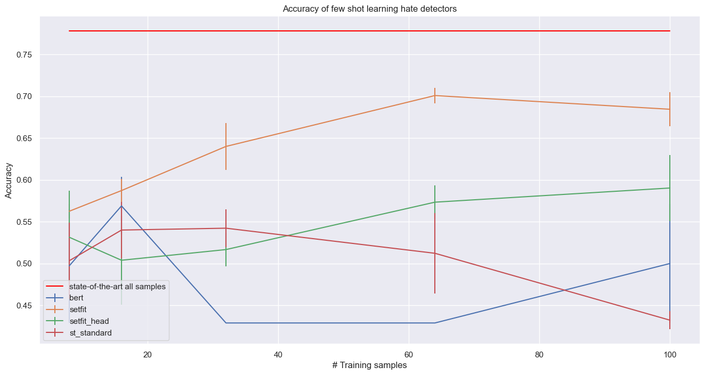
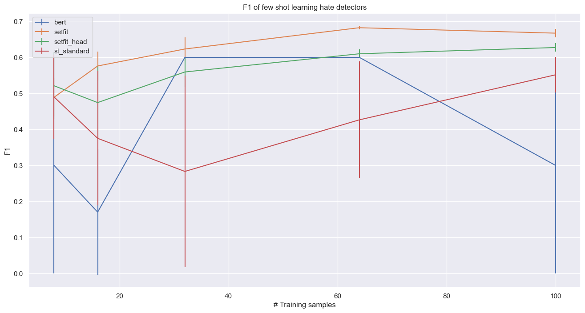

# Transfer Learning and Active Lerning

## Datasets 


* **Hate dataset** from [TweetEval](https://arxiv.org/pdf/2010.12421.pdf): Dataset labelled for hate speech detection. A tweet is classified as hate if it is hateful against any of two target communities: immigrants and women. Extracted from Se- mEval2019 Hateval challenge. 


## Transfer Learning

In this project we compare different few shot learning models:

* setfit model
* setfit model only training the classification layer
* setfit model without contrastive learning
* distilbert

### Training Setfit Model

For training the setfit model, first run in the CLI:

````
git https://github.com/bonells96/transfer_and_active_learning.git 
cd transfer_and_active_learning
pip install -r requirements.txt
````

If you want to train the setfit model as in [SetFit: Efficient Few-Shot Learning Without Prompts](https://huggingface.co/blog/setfit)

then an example for running it through the CLI is (for each use case change the arguments):

````
python src/run_train_setfit.py --PATH_DATA "users/transfer_and_active_learning/data" --name_data "train_hate" --only_head False --save_model "setfit_hate"
````

The distilbert model has been trained in this [COLAB](https://colab.research.google.com/drive/1AO23WnNXt1WiUrLBb15Wfq4m-9zSdW9v#scrollTo=i_eOGmq1eoJZ) to speed computations. 

### Experiment

We want to compare different few-shot-learning methods and their performance depending on the number of examples given for training. For each dataset we take different subsamples of different lengths.


For this case we choose to take subsamples of length 8, 16, 32, 64 and 100. All of the subsamples are balanced (same number of examples for each class).
To increase the robustness of our experiment for each length we take 5 different samples to increase the robustness of the experiment!
Then for each length size n we will initialize 5 models for each architecture train on 5 different subsamples of size n of the training set.

Finally we train the model on each subsample and we forecast the validation data and save the predictions.

### Hate Dataset

For the Hate dataset we have the following results for Accuracy and F1:
 

The setfit model is the one with the best performance. It has the best metrics and the smaller variances in the results. We see that with only 32 examples of each class the model is only 7 pts below of the state of the art in terms of Accuracy. 

The setfit_head (only head trained) model performances are clearly below the ones from the setfit model. We can see also that the results have much more variance they vary a lot depending on the samples chosen. 

Clearly the DistilBERT model is the model with the worse performance.



For the F1 the results are similar than before, but the curves gets closer. For the model without contrastive learning we observe a huge variance for few examples. This is because depending on the samples chosen the model almost only outputs one of the classes and then gets a very low F1 while having an accuracy close to 50%.

To conclude, for the Hate data we see that the setfit model, is a great option if we have few ressources for labelling. We see a great difference between the other techniques and setfit. It is strange though, that for 50 samples of each class the setfit performance is lower than for 32 of each class. Maybe with an active learning strategy for selecting the most appropiate labels the performance could be better.

## Active Learning

In this project, we aim to develop an effective strategy for selecting the best examples to label in order to improve the performance of machine learning models that have been trained on a limited amount of data. Specifically, we will be working with models that have been trained on just 100 labeled examples, and we have the ability to manually label an additional 100 examples to improve the model's accuracy. Given the limited amount of labeled data, we recognize the importance of selecting the most informative examples to label in order to make the most of our labeling efforts. We  explored different active learning approaches to select the best text for labelling.

### Experiment

We want to compare different active learning strategies.

For each dataset we train a model in 100 samples (50 samples of each class). Our model is a combination of a Sentence Transformer for the embeddings connected to a FC Neural Network:
The specifities are in this [folder](src/model.py)

````
class LinearNet(nn.Module):
    def __init__(self, input_size, hidden_size):
        super(LinearNet, self).__init__()

        self.embeddings = SentenceTransformer('all-MiniLM-L6-v2')
        self.hidden = nn.Linear(input_size, hidden_size)
        self.fc = nn.Linear(hidden_size, 2)

    def forward(self, x):
        
        embeddings = self.embeddings.encode(x, convert_to_tensor=True)
        out = F.relu(self.hidden(embeddings))
        out = torch.sigmoid(self.fc(out))

        return out
    
    def predict(self, x):
        
        out = self.forward(x)
        _,pred = torch.max(out, 1)
        return pred 

````

After training it in 100 samples we save the model.

The idea now, is to ammeliorate the model's performance by selecting the best examples to label knowing that we only have ressources to label 100 more.

We will take 4 different strategies:

1. Select 100 random texts (no strategy), we will repeat this experiment 5 times to increase the robustness
2. Select the 100 texts higher entropy
3. Select the 100 texts with lower cosine similarity to the first training set
4. Combine strategies from 2 and 3

This [notebook](/active_learning.ipynb) shows the use case for the hate dataset.

### Hate Data

For the Hate dataset we ended up with the following results:

|Model stage|Accuracy|F1|Precision|Recall|
|:---:|:---:|:---:|:---:|:---:|
|after first training|66.67|64.62|59.31|70.98|
|retrain without active learning|66.78 + 0.10|63.68 + 0.59|                                         59.96 + 0.39|67.93 + 1.84|
|retrain entropy|66.89|65.19|59.36|72.28|
|retrain similarity|66.56|64.46|59.22|70.73|
|retrain similarity ane entropy|66.89|63.92|60.00|68.39|

The strategy with best results was retraining it by taking the examples with higher entropy. We see that the results are better taking only the entropy tat combining entropy and cosine similarity. 


## Requirements

````
datasets==2.10.1
huggingface-hub==0.12.1
numpy==1.24.2
pandas==1.5.3
regex==2022.10.31
scikit-learn==1.2.1
scipy==1.10.1
seaborn==0.12.2
sentence-transformers==2.2.2
sentencepiece==0.1.97
setfit==0.6.0
tokenizers==0.13.2
torch==1.13.1
torchvision==0.14.1
tqdm==4.64.1
transformers==4.26.1
````